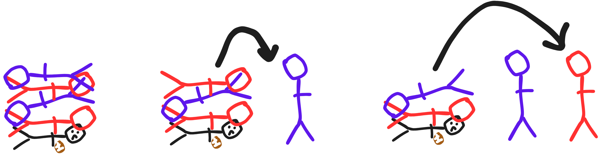
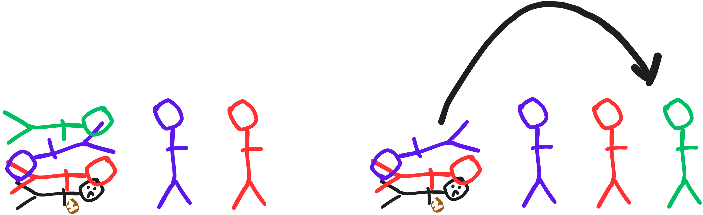

# Stacks
## Introduction
Stacks are a very useful data structure that is used to keep track of a "stack" of information. There is a certain order that items can be added or removed in a stack, which is called "Last In, First Out" (LIFO). In order to understand LIFO, lets think of an analogy with American Football.

## I. Dogpile! (LIFO Stack Analogy)
Imagine you are on the field of an American Football game. You are thrown the ball, and then tackled by a dozen players. You find yourself on the bottom of the dogpile! How would you get out? 

If you aren't strong enough to throw the heavy linebackers off you, you'll have to wait for all the players to stand up in order for you to move. Assuming your bones aren't broken.



What about the other players? Let's say that the referee is peeling players off one at a time, so the players aren't able to move until the person above them is off. That means that the player on top is able to freely move, since he doesn't have anybody above him. He was also the last person to jump on the pile. Once he is off, the next player that is now on top is able to move freely. 

What would happen if another person (pictured in green below) jumped on the pile? This person would have to be removed from the pile before anyone else could be. This manner of movement, where the last person that jumped on the pile is the first to be removed, is LIFO. This is the defining characteristic of the Stack data structure.



## II. Common Operations with Efficiencies
The following are common operation that are used with a stack, along with their efficiencies in Big O notation. You will need these in order to use a stack in your code. An example of these being used is shown in the next section.

| Operation |   Description |   Efficiency   |
|:---------|:-----------|:------------|
|Pop()|Removes and returns the first item from the top of the stack |O(1)|
|Push(item)|Adds "item" to the top of the stack|O(1)|
|Peek()|Look at the item from the top of the stack without removing or chaninging it|O(1)|
|Clear()|Clears the stack|O(n)|

## III. Pros and Cons of a Stack 

As with every data structure, you can't have everything you want. 
There are always Pros and Cons of each, as is the case with a Stack. 
The table below shows a few of them. 

| Pros |   Description |   Cons   |   Descriptionn   |
|:---------|:-----------|:------------|:------------|
|Efficient Operations|Most inherently included operations are O(1)|Limited Access|LIFO only allows access to the data on top of the structure|
|Memory Efficient|Dynamically changes memory for you as elements are added and removed|Infelxibility|LIFO operations don't inherently allow for scenarios where data from anywhere but the top is needed|
|Simple to Use|LIFO structure is straightforward and easy to use|Large Data Sets|May be difficult to use with large sets of data|

## IV. Example Problem

Continuing on with our sport-to-nerd analogy, let's go ahead and code up what our american football dogpile/stack would look like. We will demonstrate all four operations shown previously. 

Lets start out by creating a new stack, which is our first line of code below. After we use the "Push" method to add items to the top of the stack.

```csharp
var FootballPlayers = new Stack<string>();
FootballPlayers.Push("Seth Ricks");
FootballPlayers.Push("Brother Comeau");
FootballPlayers.Push("Cooper Rush");
FootballPlayers.Push("Patrick Mahomes");
FootballPlayers.Push("Tom Brady");
```

Now we'll try using the "Peek" method. This will return the first item on the stack, but not remove it.
```csharp
Console.WriteLine($"Top of the stack: {FootballPlayers.Peek()}"); 
//Prints->   Top of stack: Tom Brady
```

Now let's use the Pop method. This will take the item that is at the top of the stack and return it. In this case, all we do is remove it. We aren't using the information for anything. After we do this, let's add another player in its place. 
```csharp
FootballPlayers.Pop(); //removes Tom Brady from the top of the stack

FootballPlayers.Push("Jerry Rice"); //Adds Jerry Rice to the top of the stack
```

We've fiddled around a little bit, but now we are going to remove all the items in the stack, printing them as we go. We do this using a while loop, whose job is to take the items off the top of the stack until there aren't any more. The while loop does this with the property "Count", which returns the length of the stack. 
```csharp
while (FootballPlayers.Count > 0) Console.WriteLine(FootballPlayers.Pop());
// Removes the player on the top of the stack, and then prints in the following order:
// Jerry Rice
// Patrick Mahomes
// Cooper Rush
// Brother Comeau
// Seth Ricks
```

For the final method, we will clear the stack. To make sure that the stack is actually empty, we will add a simple if statement afterwards, which prints a message to the screen if the length of the stack is 0. Which it is!
```csharp
//Clears the stack
FootballPlayers.Clear();

//Confirms the stack is empty: message is printed to the screen
if (FootballPlayers.Count == 0) Console.WriteLine("Stack is empty! ");
```
If you would like to run this example code for yourself, it can be found here: [StackExample](https://github.com/byui-cse212/fa24-final-project-Sethricks340/blob/main/ds1-example/Program.cs)


## V. Problem to Solve
Now it's your turn! Solve the following problem:
You are given a stack of plates, which are named by color. 
You are only able to know the color/name of the plate on top. 
The plates are given the names blue, green, and red.
Design a program to count how many of each plate there are in the stack.
You are also asked to print the names of the plates in order that they are given, 
from top to bottom.


Note: When popping from a stack, if the value is not stored it is erased. This means that iterating through 
a stack takes some special care. To aid you in the process, copies of the stack are passed to the "CountColor" method, so that the stack is unaffected by this removal.

```csharp
CountColor("Red", new Stack<string>(_plates)); //Copy of _plates is passed
CountColor("Blue", new Stack<string>(_plates)); //Copy of _plates is passed
CountColor("Green", new Stack<string>(_plates)); //Copy of _plates is passed
```

The file of this project can be found here: [StackProblem](https://github.com/byui-cse212/fa24-final-project-Sethricks340/blob/main/ds1-problem/Plates.cs)

Please do not look at the solution to this problem until you have attempted it yourself. When you are ready, 
the solution code can be found here: [StackSolution](https://github.com/byui-cse212/fa24-final-project-Sethricks340/blob/main/ds1-solution/Plates.cs)