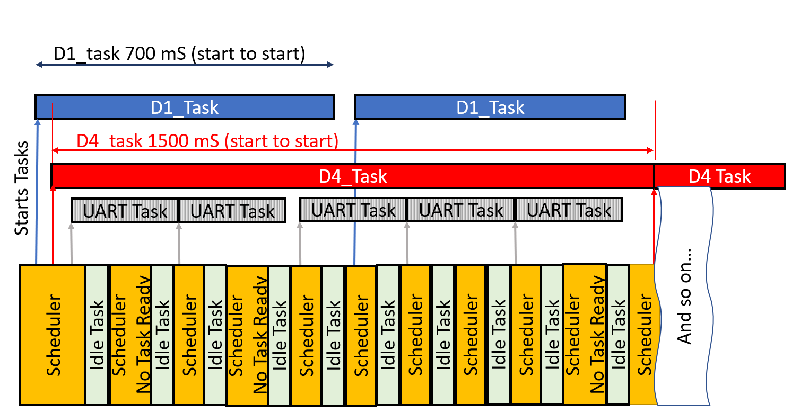
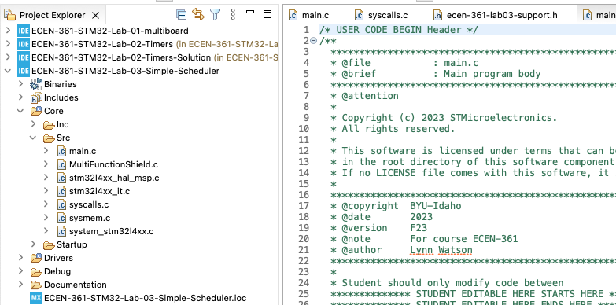
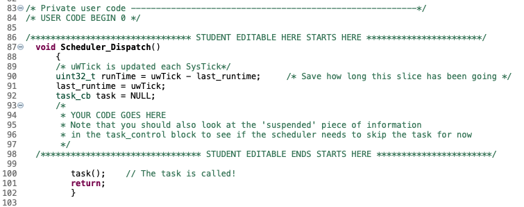
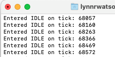
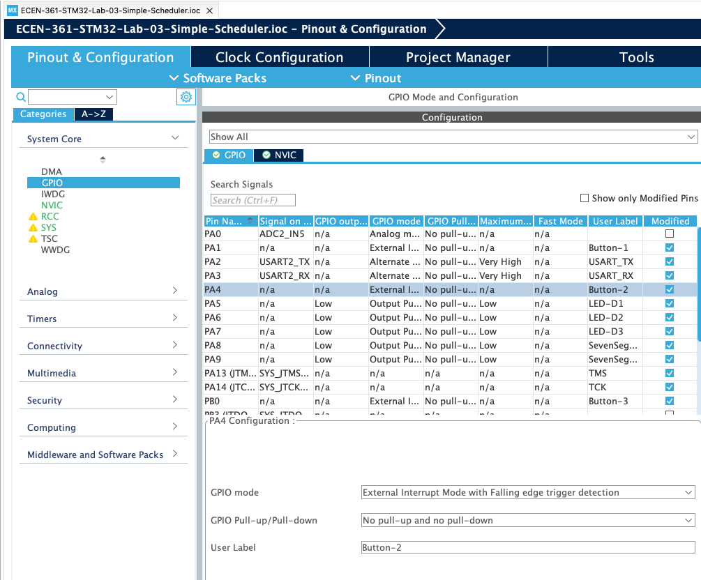
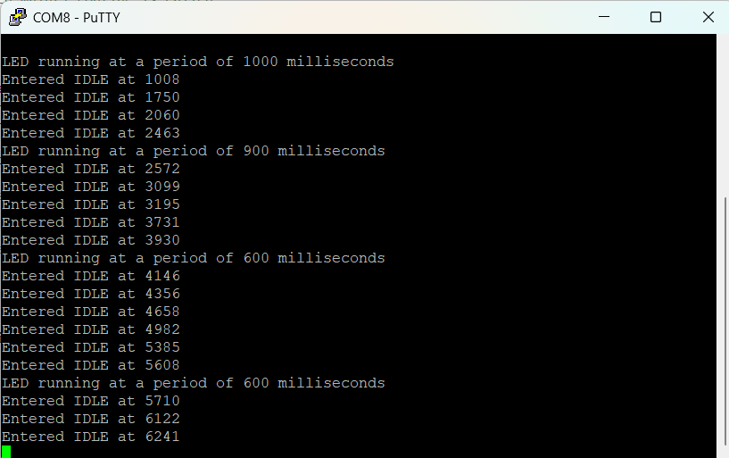

# Lab-03: Writing a Simple Scheduler

## Introduction

In this lab you will create a scheduler on your Nucleo-476RG that will execute three tasks at predetermined rates. To do this you will create a scheduler. A scheduler is a set of code that keeps a queue of possible processes/threads/tasks (we'll say “**task**” here) and decides which of these should be executed at what time on the processor.

In order to keep this simple you will not be implementing a pre-emptive scheduler. A pre-emptive scheduler is a scheduler that can interrupt a task in the middle of execution, save the context (Program Counter/Stack Pointer/Register States), run the scheduler to decide with task should have time on the processor, and then restore that task, then continuing running it.

In this non-pre-emptive scheduler, each task runs and will continue until it is done completed, then the scheduler will determine which task should run next. This scheduler allows the processes to be started at different intervals and seemingly run in parallel. In the scaffolding code provided, there are three tasks written to be run at setup (times can be easily changed):

1. **D1 task**  every 700 mSec

2. **D4 task** every 1500 mSec

3. **Serial Port (UART) Write** every 2000 mSec
   
   **Idle task** runs in-between

When the scheduler runs it will look for any task that should be run (according to its defined start time).

The scheduler will choose the first one in the queue. When that task is run, the scheduler checks to see if it's time for the next one in the queue, and will run that, … , etc. until none are left ready to run. The scheduler will then go into an idle task.

Note that you're not writing a true scheduler with the ability to 'suspend' a given task and then swap to another. This scheduler simply starts the tasks on a pre-defined schedule. Each of the tasks must start and then return to the scheduler. We're not saving task state (“task control block”) information or doing anything like a context switch. For this reason, the tasks have been written to be a simple LED toggle: Toggle the LED and return and wait for the scheduler to come back and toggle again.

### Implementation

Like all schedulers, a 'slice' of time to run a task and look for the next task has to be provided. This is done here, like most, with a Timer Interrupt. The STM32 comes pre-configured with a timer designated to be used as the SYSTICK time slicer. This timer updates an absolute count that keeps track of the number of SysTick (1 milliSecond) clocks since the processor started. The global HAL variable “**uwTick**” increments once every 1mS.

### Setup

Follow the same procedure as previous labs, accepting then cloning the repo from the GitHub classroom (link in the Canvas Assignment). Clean and Build the Project.

There should be no errors or warnings.

As always, source code is in **Core/Src/main.c**

## Lab Activities (6 pts)

Write the remainder of the **Scheduler_Dispatch()** code (about line 80 in **main.c**).

This will be completed by creating a loop to go through the task queue and seeing if it's time to run the task being inspected. Remember to take into consideration the '**suspended'** field in deciding if it should be run or not. Any code written must be between the “EDITABLE” fields, and don't modify lines outside of there. The lines outside are generated by the STM32 .IOC GUI to setup the controller.


  

### You should familiarize yourself with the \`list_of_tasks_to_do' variable, and its associated struct type \`taskControlBlock' in order to utilize them in your task scheduler. They are located in the \`ecen-361-lab03-support.h' header file.

  

You'll be able to verify operation with 3 different output:

- LED_D1 and LED_D4 lights blinking at their appropriate rates.

- The far left and far right 7-Segment displays will count from 0-9 and 0-5 just showing the countups

- The terminal emulator output will show
  
  Output streaming **uwTICK** value each IDLE

If you have difficulty seeing the serial communication coming through a terminal emulator, contact a T/A or Instructor.

1. Verify that the **S1** (GPIO pin is called Button_1) switch suspends **D1_task** blinking process. Note that it stops at the same state (on or off).
2. Add an interrupt for **S2**. This will be a second ISR, that does the same thing for **D4_task**. To add this interrupt, you'll first need to edit the “.IOC” setup file. In the GUI, go to the System Configuration/GPIO/ and tag the pin to be an interrupt:
   

Saving and closing this view will re-generate your **main.c**. You can then modify the **HAL_GPIO_EXTI_Callback()** routine to match the S1 interrupt as appropriate.

## Questions

1. List a shortfall that makes this method not a true 'scheduler'? <br>
**This isn't a true scheduler, because it is not there is no interrupting or priorities. A currently running taks block all other tasks until it is done! If this is what my PC was running on, it would be impossible for me to run STM32 Cube IDE, have serial communication with the STM board, and type on this document all at "once." It isn't really all happening all at once, just really really fast and taking turns at a superhuman speed.**

2. Was there any priority built into this system? <br>
**No, there is no priority built into this system. The task that is chosen to run is purely the next available and non-suspended one in line.**

3. Are the variables in the processes (D1_task and D4_task) local or global?   How do you tell and why would either be used or must be used?<br>
**These variables are global. We want global variables in this case because we don't want their values to change once we exit a function. Local variables are only valid inside the function where they were declared. It would be bad if the remaining time for one of these tasks reset as soon as we stopped looking at it.**


4. For the interrupts on Button_1/2, why were the GPIO modes set to be Falling edge trigger? <br>
**Because these are active low buttons, meaning that pushing them connects the signal to ground, a falling edge trigger means that the interrupt is triggered as soon as the button is pressed down, not on release. To confirm this, I set my button 2 to rising edge. Sure enough, button 1 interrupt happens on the push down (I can hold it down and it still did the interrupt), and button two interrupts when I release.**


## Ideas for Credit to get to 'A' & Extra-Credit (2 pts for any)


1. Use the 3rd button (S3) to alter the time of a task's execution.  For example, each S3 press increases/decreases the delay by 300mS.

2. Add input from the user via the TTY terminal to adjust the times

3. Suspend one of the processes after it's run a pre-set number of times

4. Put out a message when either/both of the buttons are pressed and the processes suspended.  If both are suspended, quit putting out TTY messages.

5. Your task scheduler list has free space where you could introduce another task; implement another task and describe its functionality.
<br> <br> 

**I chose to do 5 things for this section. These included: creating a new task, linking this task to a third button, printing another changing number to a 7-segment LED, changing the period of the new task with the button input, and printing the period to PuTTY.**<br>
<br>

**I did this because I was curious about how fast my eyes could perceive the changing numbers. I found that around 20 Hz it became impossible to tell that the 7 Seg LED was even changing at all!**<br><br>

**I did this with the following code, in main.c and in ecen-361-lab03-support.h:**

```c
// In ecen-361-lab03-support.h
...
void D3_task()
{ 
   TASK_D4_LED_TOGGLE
   MultiFunctionShield_Single_Digit_Display(1,Task_D4_Count--);
   uart_buf_len = sprintf(uart_buf, "LED running at a period of %d milliseconds\r\n", list_of_tasks_to_do[2].period);
   HAL_UART_Transmit(&huart2, (uint8_t*)uart_buf, uart_buf_len, 100);
   first_idle = true;
}
...
```

```c
// In main.c
...
case Button_3_Pin:
   if (list_of_tasks_to_do[2].period >= 150){
      list_of_tasks_to_do[2].period -= 100;
   }
   // Max period of 1 ms
   else if (list_of_tasks_to_do[2].period > 1){
      list_of_tasks_to_do[2].period -= 1;
   }
   break;
...
```

**As the period of this task changed, I found something very interesting - the "Entered IDLE at 'time'" printed way more often! I was perplexed by why this was happening. But thinking about it makes it obvious. If this was running at less than 100 ms for the period, it is super small compared to the other ones. This means that it runs way more often, and the IDLE task is flagged way more often. Below is an example of my descreasing period happening because of the user input. It worked!**

   


