# ECEN-361 Lab-05:SPI & Logic Analyzer

     Student Name:  Seth Ricks

## Introduction and Objectives of the Lab

This lab will require very little code development. The project as cloned from the GitHub-Classroom, runs without modification. You'll be asked to use a logic analyzer to capture traces of the formats and compare their utility.

- Part 1: Physical observation of different digital serial communication protocols: I2C, SPI, and UART
- Part 2: Become familiar with a logic analyzer, capture & decoding capabilities.

For each of the parts, follow the instructions, then fill in answers to the questions. Expected answers are indicated with <mark>[*answer here*]</mark>.

## Part 1: Accept the Assignment, Download the repo, Run it

Same initial procedure as previous labs - get the laboratory into your STM32CubeIDE workspace, then clean/build/run it.

#### Step 1: Install a terminal emulator program

In order to interact with the program, you'll need to bring up a serial terminal emulator, like PuTTY or Tera Term (windows) or screen (MAC).

Terminal emulator specs are (always the same for this class):
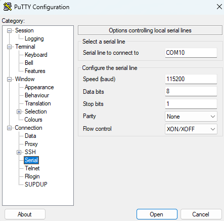

Your COM: port will be found with DeviceManager or on a MAC as (/dev/tty…). If you install a terminal emulator like Tera Term, it will enumerate your COM ports for you. :)

With a terminal emulator running you'll see the opening banner and a prompt to enter a line of text:

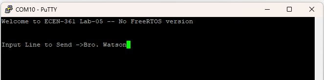

#### Step 2: Install the Saelae Logic Analyzer Software: [Logic 2](https://www.saleae.com/downloads/)

#### Step 3: Connect and label the probes for the SPI, UART and I2C:

To probe the SPI and I2C pins, you'll use the following:

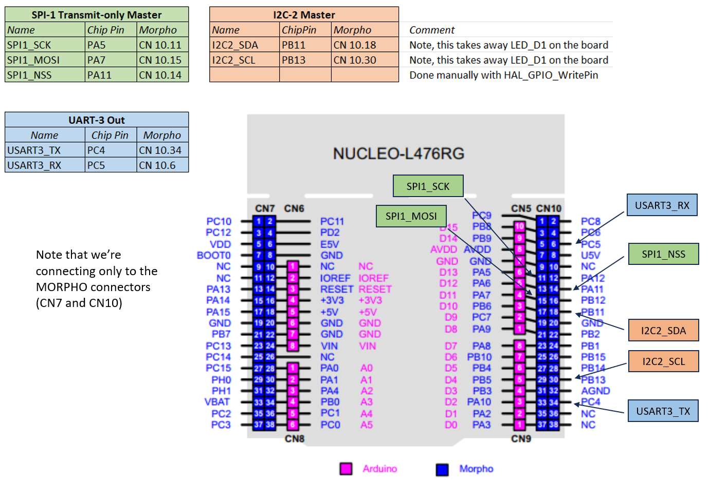

Note that these pins are found from the STMCubeIDE configuration file. Opening will show (SPI1 for example):
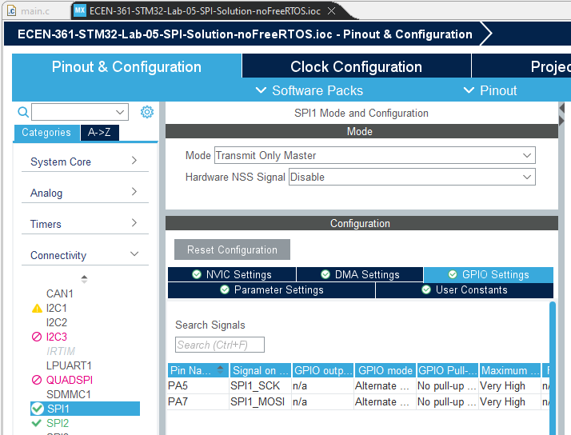

Go to the GPIO Settings tab to see what pin names are assigned to each signal. You'll manually change and configure I/O pins later and in other labs, so be sure you know how to find what signal is assigned to what I/O pin!

Plug in the logic analyzer and run the “Logic 2” program.

Connect probes from the Saelae Logic, using:

- GND (Black pins are on bottom)
- SPI1_SCK
- SPI1_MOSI
- SP1_NSS

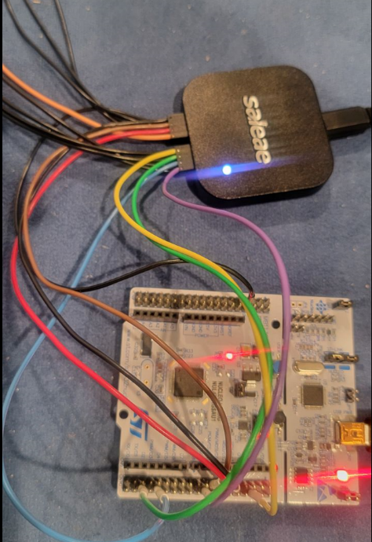

Label them in the software. Make sure the inputs are Digital:
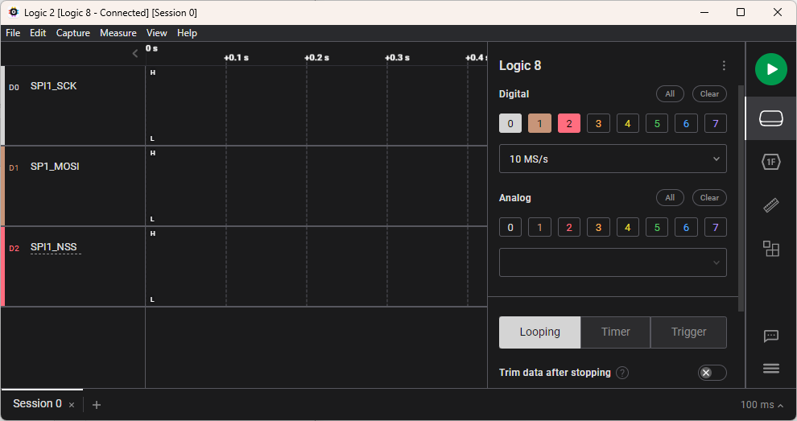

Program the Analyzer to decode SPI:
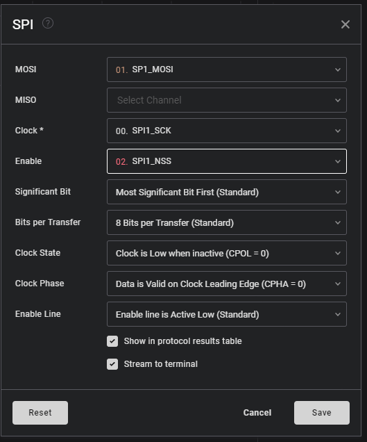

Set the mode to trigger on the falling edge of SPI1_NSS:
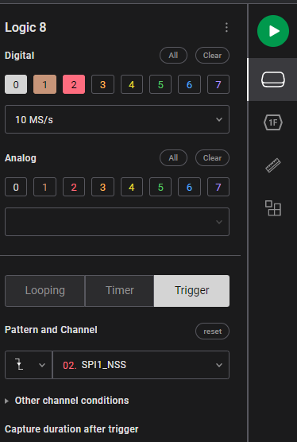

Run a capture on the Logic2 (big green play button).

Enter some TXT into the TTY emulator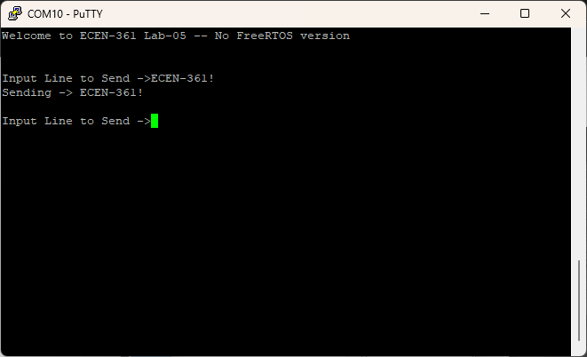

Look at the results. Change the output formatting to be ASCII

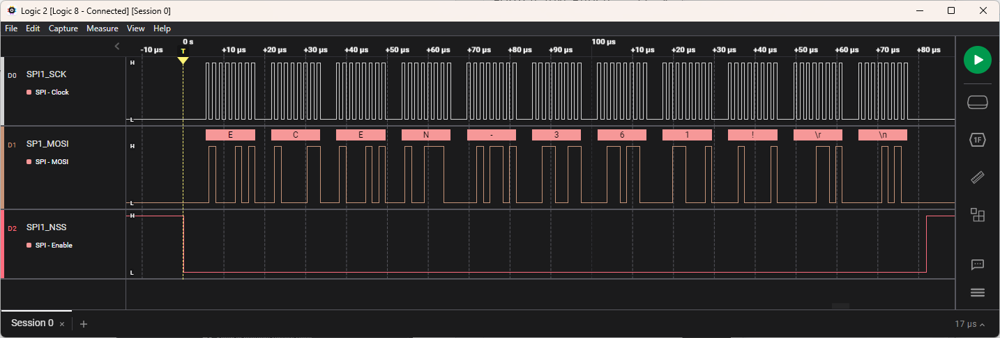Experiment with this, send different codes, learn to use the tool, then answer the following questions:

## Part 1: Questions

**Below is my name transmitted over SPI!**
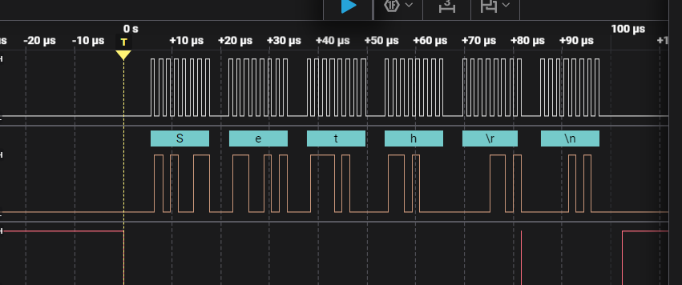

* What is the default bitrate?  (time per bit)  -- Use the measurement tool (looks like a ruler): 

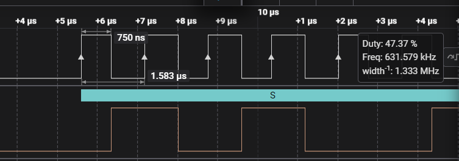

**From the image above, I believe that the bitrate has a period of 1.583 microseconds, or the time from one rising edge to another. In frequency this would be 632 kHz, which is the same as the box on the right.**

* How much time between each byte?

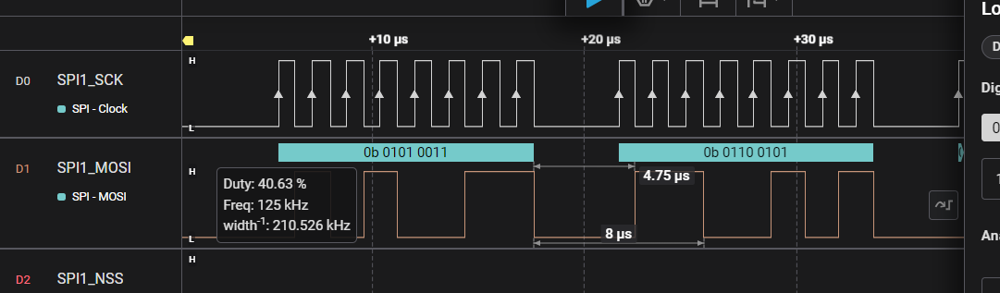

**From the image above, I believe that the time between each byte is 4.75 microseconds, which is the space between the last information from the last byte and the first bit of information from the next byte. In frequency this would be 210 kHz.**

* Which has more overhead:  USART or SPI? And why? <br>**I believe that SPI has less overhead, because it doesn't use any start or stop bits. SPI is just pure data with a chip select line.**

The transfer rate is a function of a clock divider on the main clock (80Mhz). Default in your code is 128. Find the line that defines this: hspi1.Init.BaudRatePrescaler = SPI_BAUDRATEPRESCALER_128; rate in **main.c.** Change this line to make the SPI transfer as fast as possible, compile, run, and capture the results and note what you see.

* What is fastest bit rate possible with this processor?  Equation? <br> **The fastest possible bit rate is 40 MHz. This is because the smallest prescaler allowed is 2. So with a system clock of 80 MHz, 80/2 = 40 MHz. The equation is:** 
$$
f_\text{SPI} = \frac{f_\text{PCLK}}{\text{Prescaler}}
$$

* Is there any problem capturing the fastest data of a SPI channel with the logic analyzer? <br>**The Logic Analyzer only has settings for a sample rate up to 24 MS/s, which is 24 million samples per second. So messages with a frequency of higher than 24 Hz will not work. I tried it with 40 MHz, and you get a message like this:** 
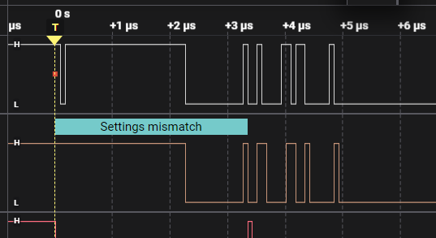

## Part 2: Doing the same with I2C

For this part of the Lab, you will use an LCD Display over I<sup>2</sup>C

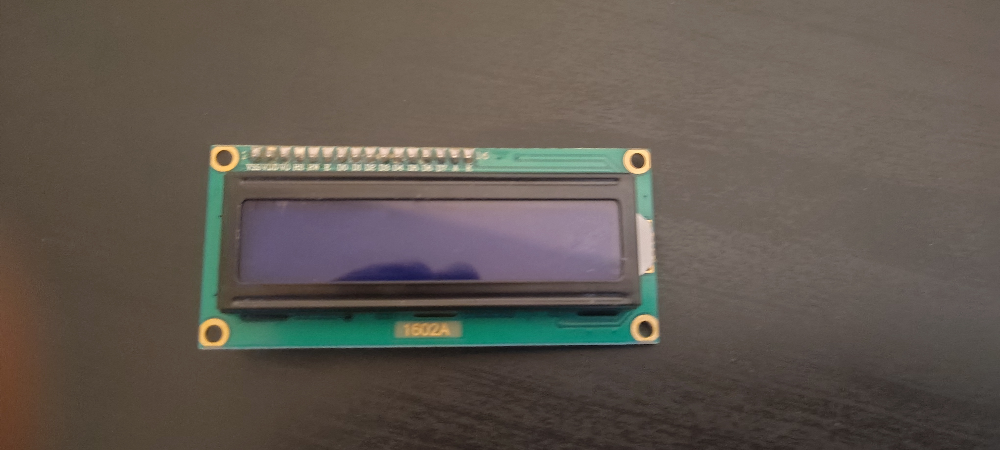

Connect the SDA, SCL, GND and VCC pins to the Nucleo Board. (Ensure VCC is connected to 5V, not 3.3V)

Attach the I2C Signals to look at the data coming out, then answer:

**Here is my name over I2C:**

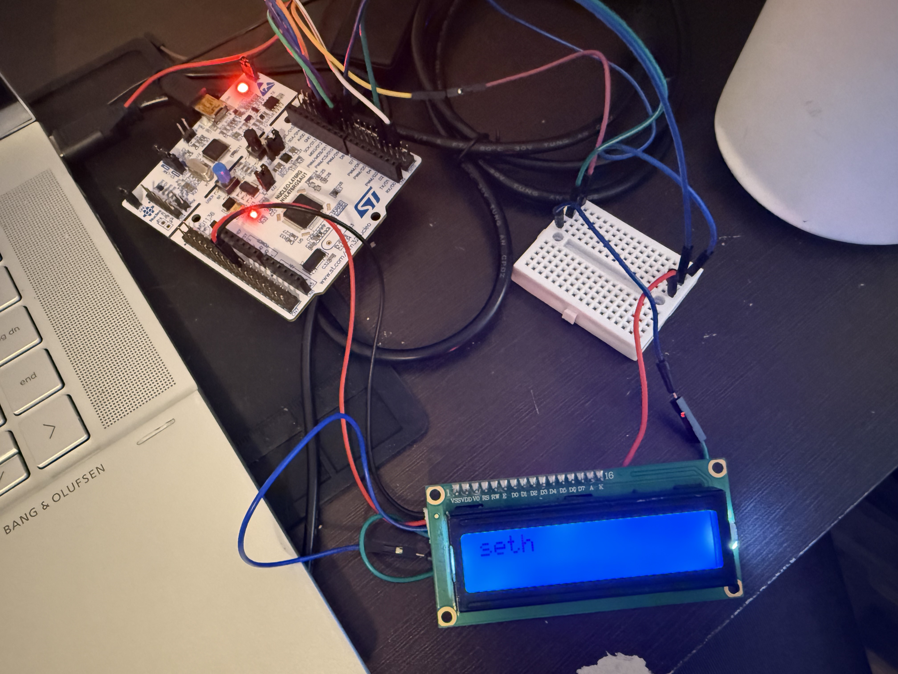
* What is the default bitrate?  (time per bit)  -- Use the measurement tool (looks like a ruler) <br> **It looks like the default bitrate is 98.4 kHz, corresponding to a period of 10.2 microseconds**

* How much time between each byte? <br> **There is around 16.5 microsecond between each byte of data being sent.**

* What is the value of the data coming out first?  (It's not like the others.) <br> **The first parts of data that comes out of the i2c is the "Setup Write + ACK", whic is the setup start to the transaction.**

## Part 3: Doing the same with a UART

<br>**Here is my name over UART:**
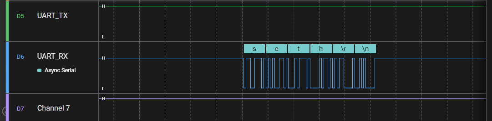

Attach the USART3_TX and RX and sample again, looking at the data coming out, then answer:

* What is the default bitrate?  (time per bit)  -- Use the measurement tool (looks like a ruler) <br>**The default bitrate was actually 38400, but the code that was given to use needs to be 115200. So I had to change that to make it work.**

* What is the max bitrate easily supported?
<br>
**If you try to put in a high bit rate, it says, "Bit Rate (Bit/s) must be less than or equal to 100000000 (maximum)"**

## Ideas for Credit to get to 'A' & Extra-Credit (2 pts for any)


**In the interest of time, I decided to only do two one of the extra credits. These were to print the number of bytes sent to the seven segment LEDs on the multifunction board, and to change the SPI to be non-blocking.**

* Instruction: Add on the MultiFunction Board, and have it display the number of characters sent each time.
<br>
**The gif below shows me doing this , sending the message "seth/r/n" and displaying that I sent four bytes to the MultiFunction board. The /r is a carriage return and the /n is a new line that is built into the code already given. I printed to the seven segment LEDs simply, using this line:**
```c
/* USER CODE BEGIN 3 */
bytes_in = Read_and_Transmit_Task();   // Already given
MultiFunctionShield_Display(bytes_in); // Write the # of bytes to 7Seg display
```

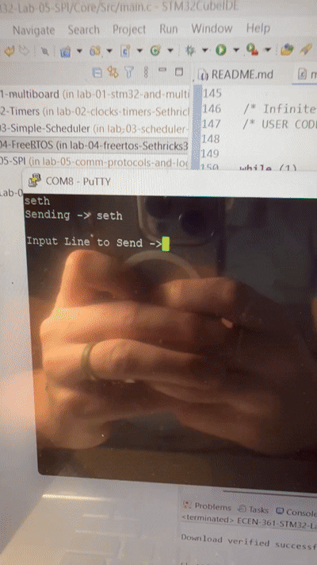


## Reference

The following is a capture of all three protocols.

Notes that you'll need:

- The LogicAnalyzer can apply different protocols to different signals. In this case all three are shown
- I2C in master mode first transmits the address (here it's 0x11), then waits for the ACK to send the data. Without a SLAVE no data will actually be sent
- The UART is much slower and has overhead of start/stop bits

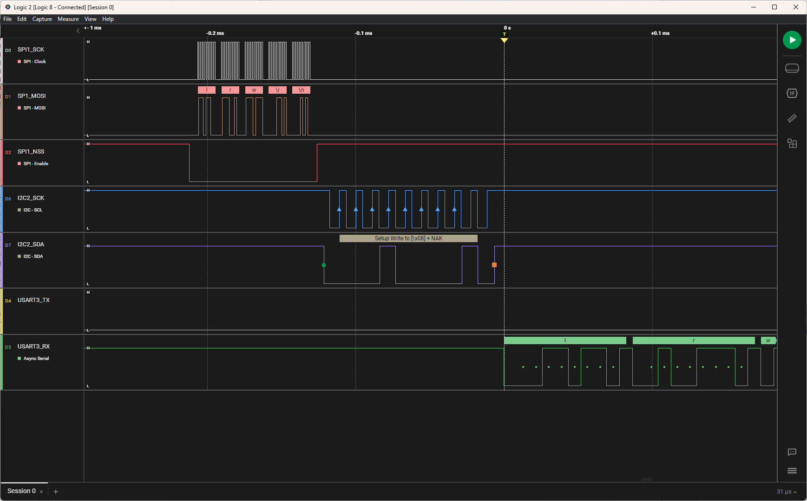
