# ECEN-361 Lab-07: DMAs with ADC/DAC

## Introduction and Objectives of the Lab

Part 1: Learn how a Sine Wave can be created from a µController and investigate the characteristics and limitations of an ADC Controller (the one built into the STM32)

Part 2: Exposure to and use of DMA channels in a µController.

Part 3: *(TBD 2nd week: Use an external graphing tool to measure a signal on the STM32 Board.)*

For each of the parts, follow the instructions, then fill in answers to the questions. Expected answers are indicated in the boxes with red text/spaces to fill in answers.

## Overview of System

The project, as configured in the repo, is a bare-metal (no FreeRTOS) that is configured like this:

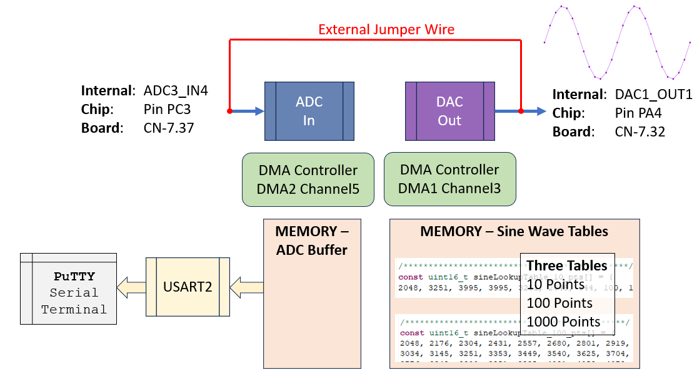

Explore the GUI by opening the  **ECEN-361-STM32-Lab-07-ADC-DAC-DMA.ioc** file to see the configurations.

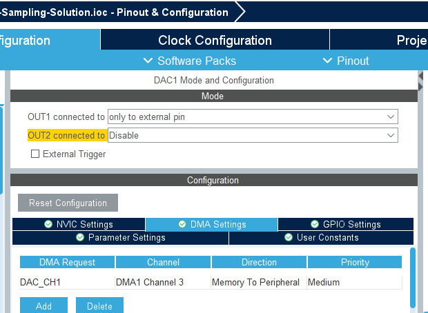

In this configuration, the DAC drives an analog sinewave ouput which is wired (external jumper wire) from its output pin, back to an ADC input pin. The transfers are set up to be done automatically, via DMA channels. Once these channels are configured, no uProcessor cycles are required to effect the transfer out (DAC) or the transfer in (ADC). The DMAs are configured to automatically:

- Read from a memory buffer (cyclically) and write to a fixed peripheral address (DAC).
- Read from a peripheral I/O address (ADC) and write to a memory buffer (cyclically).

### Sine Wave Generation

Often, in embedded systems with limited compute power, an output waveform (like a Sine Wave) is created by calculating the points of the wave thru a cycle. Tools help generate these, depending on the number of points per cycle, the output voltage displacement, etc. In this approach, a memory value is read, its analog value put out to the pin in a periodic manner. For this lab, a simple web-based calculator ([SEE HERE](https://deepbluembedded.com/sine-lookup-table-generator-calculator/)) created the integer values of the sine wave over time. If these are plotted over time, they look like this (depending on the number of points):

In this simplistic version, only 10 points / cycle are used, so the wave re-creation is crude:

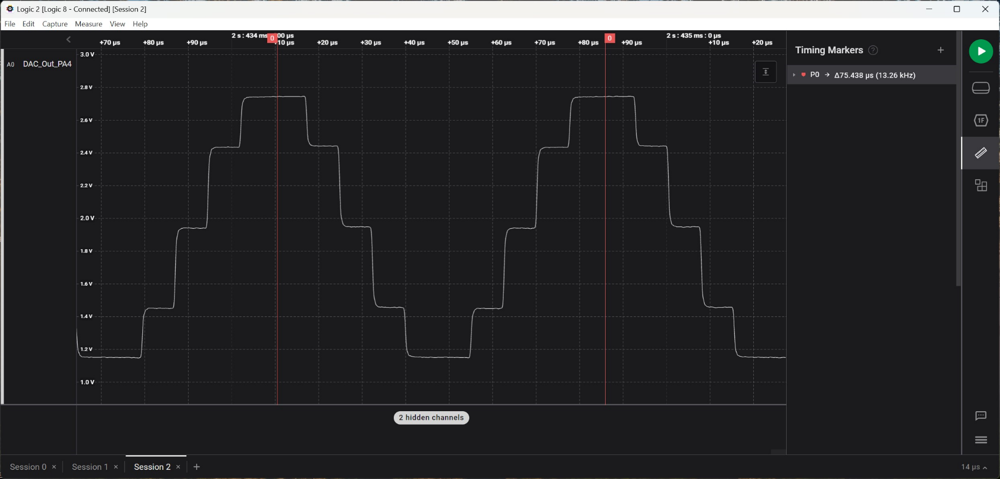

The values to create the wave are put in an integer array, sequentially providing the points of the sine wave – See the ‘**sinewavetable.h’** include file in the project. For the lab, three different arrays have been populated with values of differing points per cycle to make up a single period:

- `const uint16_t sineLookupTable_10_pts[];`
- `const uint16_t sineLookupTable_100_pts[];`
- `const uint16_t sineLookupTable_1000_pts[];`

We’ll compare the outputs of using different points/sample in this lab.

## Questions

* Look at the sine wave tables in the include file.  What is the range of the values in the tables for each of the differing points/cycle?
  
  **For "sineLookupTable_10_pts", the range is 100-3995.**
  <br>
  **For "sineLookupTable_100_pts", the range is 0-4095.**
  <br>
  **For "sineLookupTable_1000_pts", the range is 0-4095.**

* If this is going to the DAC, explain the ranges stored in the table
  <br>
  **According to the comments, this is a 12-bit DAC, so the overall range would be 0-4095. 12 bits can have a max value of 12 ones, or 2^12 values. This means there are 4096 values, or a range of 0-4096.**

## Part 1: Looking at the Sine Wave Output

1. Connect the DAC out to the ADC in
   
   You’ll need a single jumper (from your ECEN-106 kits or available during lab time). Connect the DAC-out to the ADC-in (CN-7.32 CN-7.37)

2. Run the code.
   
   Your board should show “10” on the 7-seg display
   
   The 7-Seg LEDs indicate which of the points-per-cycle table is being used to output the DAC waveform.:10, 100, 1000. These values are cycled by pressing **S1**.   
   
   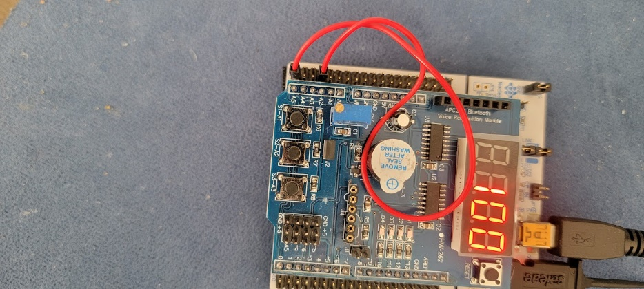

3. Look at the analog wave out with the Saleae Logic Analyzer.
   
   Connect / Configure the Logic Analyzer, same as previous labs, to use one of the inputs in analog mode. Connect the probe to the one of the red jumper wire endpoints, and connect a ground on the probe header.
   
   Cycle through the different points/cycle option (Switch S1) – you should see something like this, with differing smoothness:
   
   100 Points / Sample
   
   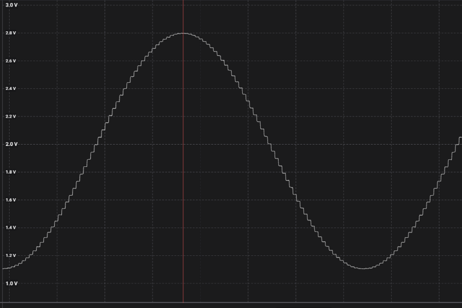
   
   1000 Points / Sample
   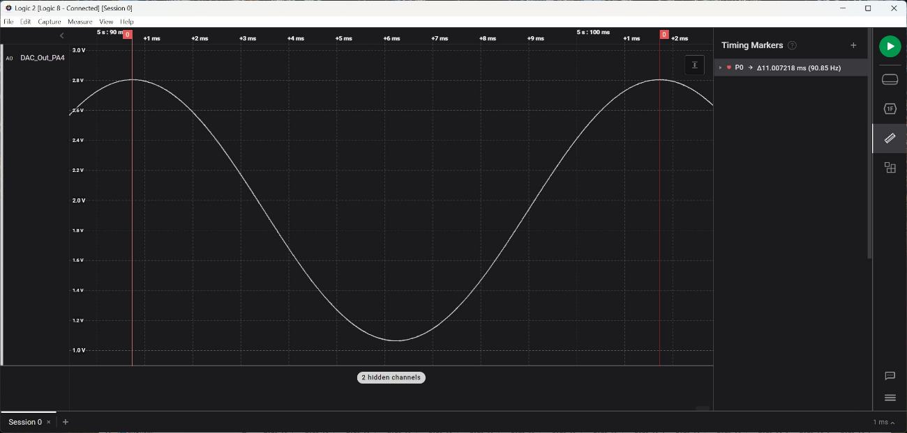

---

Set the triggering to loop and adjust the sample rate and length of sample to get a good picture of each of the three different waveforms. Note that you can auto-adjust the vertical size of the analog wave to get a more readable picture. Use the ruler tool (shortcut: \<CTRL\>-T) to get accurate time differences.

### Questions (2 pts)

* Measure the three waveforms and fill out the following table:
  
  | WaveformPoints / Cycle  | 10                           | 100                          | 1000                         |
  | ----------------------- | ---------------------------- | ---------------------------- | ---------------------------- |
  | Period of Wave          | $\approx$ 10 ms | $\approx$ 100 ms | $\approx$ 1 s |
  | Time between each point | $\approx$ 1 ms| $\approx$  1 ms | $\approx$ 1 ms |

* Take/Paste a screenshot showing the measurements of each of the three samples/cycle, showing the frequency measurements.
  
**10 points/cycle:**
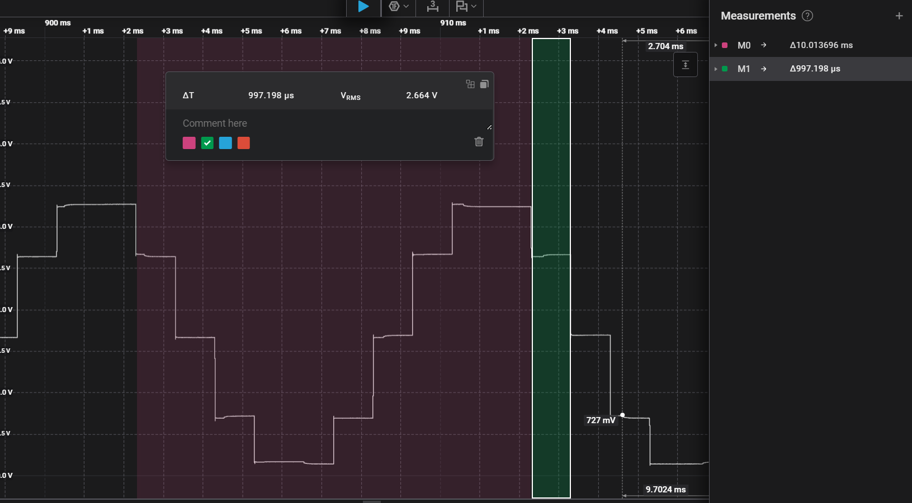

**100 points/cycle:**
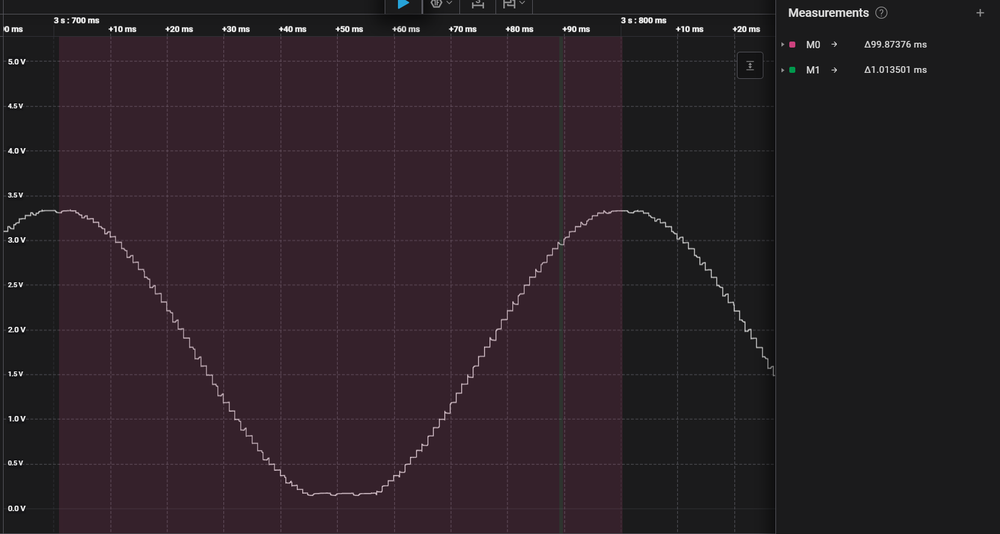

**1000 points/cycle:**
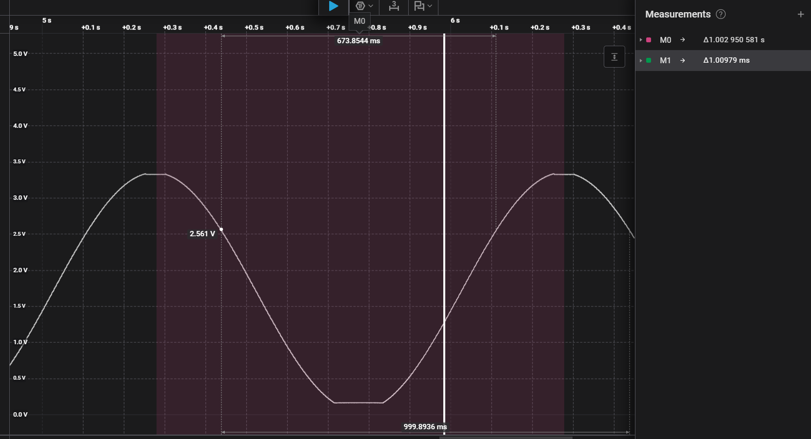

---

The DMA controller has been configured to run cyclically – meaning after all the buffer entries are read, the DMA controller starts over again and reads sequentially thru the addresses. This continues as long as the DMA is enabled.

The timing of the DAC conversions can be free-running  
(“No trigger” = go as fast the conversion time allows) or based on a trigger. For this lab, the trigger has been configured to be one of the timers – Timer2.

**See the .IOC GUI:**

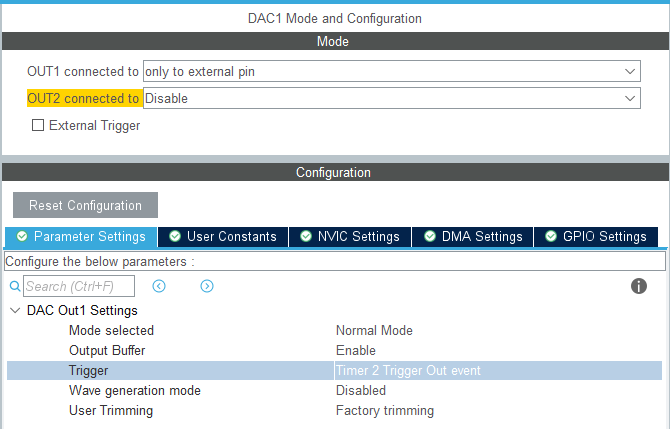

This means that the DAC conversion will start only as often as the Timer2 Trigger happens.

**Timer2 is configured:**

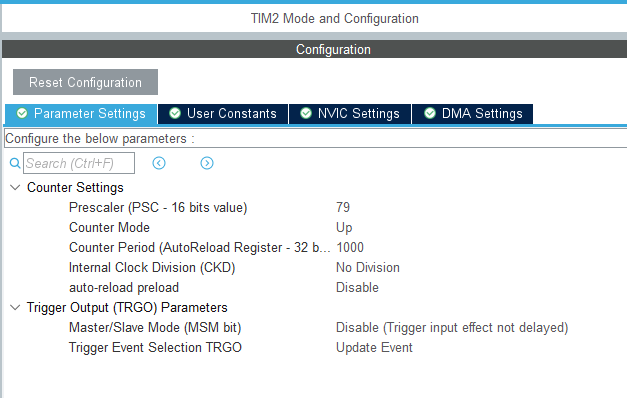

As configured, the timer should call for a conversion

80 Mhz / 80 (pre-scaler) / 1000 == 1 KHz. Every mS.

By adjusting Timer2, you can change the frequency of the sinewave coming from the DAC.

## Questions (3 pts)

* Adjust Timer2, recompile each time, and measure to fill in the tables.  If the system breaks put “breaks” in the box.

| Case “A”        | Prescaler: 79        | Counter Period: 10000        |
| --------------- | -------------------- | ---------------------------- |
| 10 Pts/Cycle:   | Period of wave:      | $\approx$ 100 ms |
|                 | Time between points: | $\approx$ 10 ms |
| 100 Pts/Cycle:  | Period of wave:      | $\approx$ 1 s |
|                 | Time between points: | $\approx$ 10 ms |
| 1000 Pts/Cycle: | Period of wave:      | $\approx$ 10 s |
|                 | Time between points: | $\approx$ 10 ms |

| Case “B”        | Prescaler: 79        | Counter Period: 1            |
| --------------- | -------------------- | ---------------------------- |
| 10 Pts/Cycle:   | Period of wave:      | $\approx$ 20 $\mu$ s |
|                 | Time between points: | $\approx$ 827 ns |
| 100 Pts/Cycle:  | Period of wave:      | $\approx$ 200 $\mu$ s |
|                 | Time between points: | $\approx$ 858 ns |
| 1000 Pts/Cycle: | Period of wave:      | $\approx$ 2 ms |
|                 | Time between points: | $\approx$ 831 ns |

| Case “C”        | Prescaler: 7         | Counter Period: 100          |
| --------------- | -------------------- | ---------------------------- |
| 10 Pts/Cycle:   | Period of wave:      | $\approx$ 100 $\mu$ s |
|                 | Time between points: | $\approx$ 10 $\mu$ s |
| 100 Pts/Cycle:  | Period of wave:      | $\approx$ 1ms |
|                 | Time between points: | $\approx$ 10 $\mu$ s |
| 1000 Pts/Cycle: | Period of wave:      | $\approx$ 10ms |
|                 | Time between points: | $\approx$ 873 ns |

| Case “D”        | Prescaler: 7         | Counter Period: 5            |
| --------------- | -------------------- | ---------------------------- |
| 10 Pts/Cycle:   | Period of wave:      | $\approx$ 6 $\mu$ s  |
|                 | Time between points: | $\approx$ 811 ns |
| 100 Pts/Cycle:  | Period of wave:      | $\approx$ 60 $\mu$ s |
|                 | Time between points: | $\approx$ 842 ns |
| 1000 Pts/Cycle: | Period of wave:      | $\approx$ 600 $\mu$ s |
|                 | Time between points: | $\approx$ 842 ns |

* Are the results predictable and correlated with the timer?  What would the FREQUENCY be with 1000 pts/cycle if the Timer2 had:  Prescaler=799, Counter_Period=100?
<br>
**Yes, it is predictable. The equation is:**
$$f_{wave} = {\frac{f_{sys}}{(Prescaler+1)*CounterPeriod*PtsPerCycle}}$$
**Plugging in the varaibles given would be...**
$$f_{wave} = {\frac{80MHz}{(799+1)*100*1000}}=1Hz$$

* When the trigger for the DAC DMA  (Timer2) was set to go too fast, what happened?
  
  **When the Timer2 was set too fast, it was too fast for the logic analyzer to read at times. In my simulations, sometimes it would flatline or give unpredictable values.**
  
  Any ideas why?
  
  **The clock was too fast for the logic analyzer to read reliably.**

* Sending out the DAC via the DMA, the point-to-point timing gets set by the trigger frequency. Could a polling-based approach be faster (supposing the DAC conversion time was zero)? If so, why use DMA?
  
  **The polling could potentionally be faster, but I doubt it. The reason that DMA is better is because it allows the processor to do other things. If the processor had to constantly deal with moving and reading/writing memory, it wouldn't ever have time to do anything else.**

* Note on the analog waveform from the DAC that the nadir (lowest point) of the waveform doesn’t go all the way to 0.0Volts.  It looks to be “clipped” at about 0.6 V.   Explain why :
  
  **The DAC uses an op amp to convert a digital signal into an analog one. As the digital signal reaches zero, the transistors leave the saturation region and enter saturation. The voltage across a transistor in the saturation region is around 0.6-0.7 Volts, which is what is seen here. The op amp can't produce a pure 0 voltage because of this.**

## Ideas for Credit to get to 'A' & Extra-Credit (2 pts for any)

**I decided to generate four new signals: triangle, rising sawtooth, falling sawtooth, and square waves. The images of these can be seen below, along with an explanation of how I accomplished this.**

**Triangle wave:**
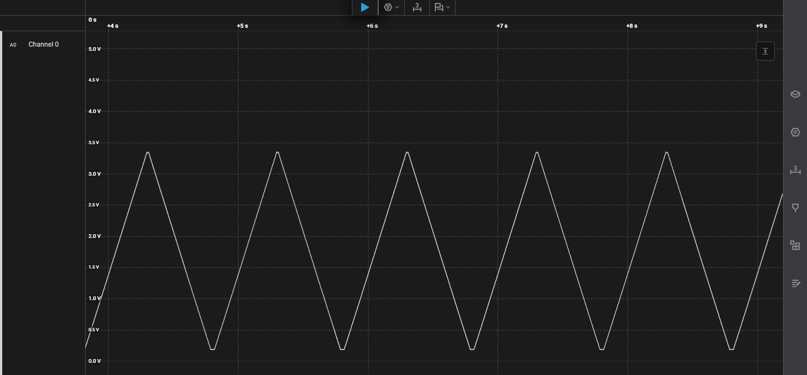
<br><br>
**Rising Sawtooth wave:**
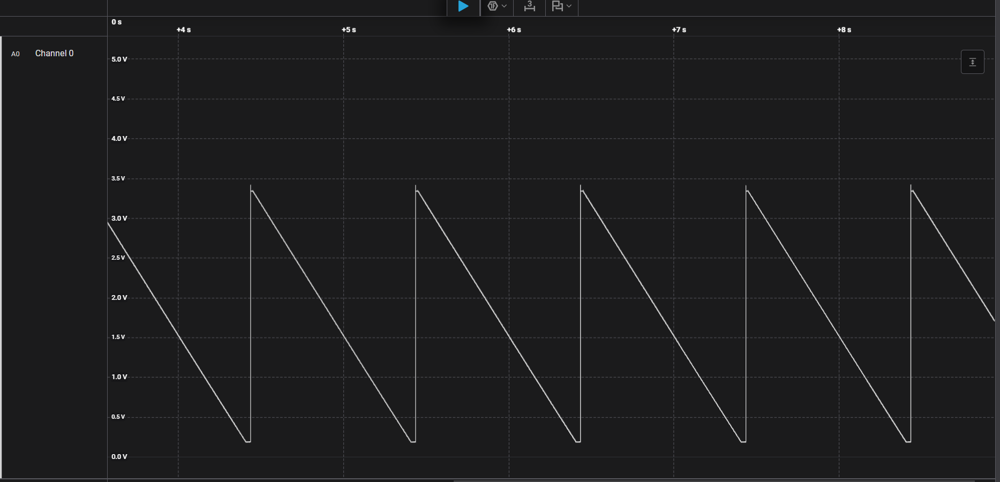
<br><br>
**Falling Sawtooth Wave:**
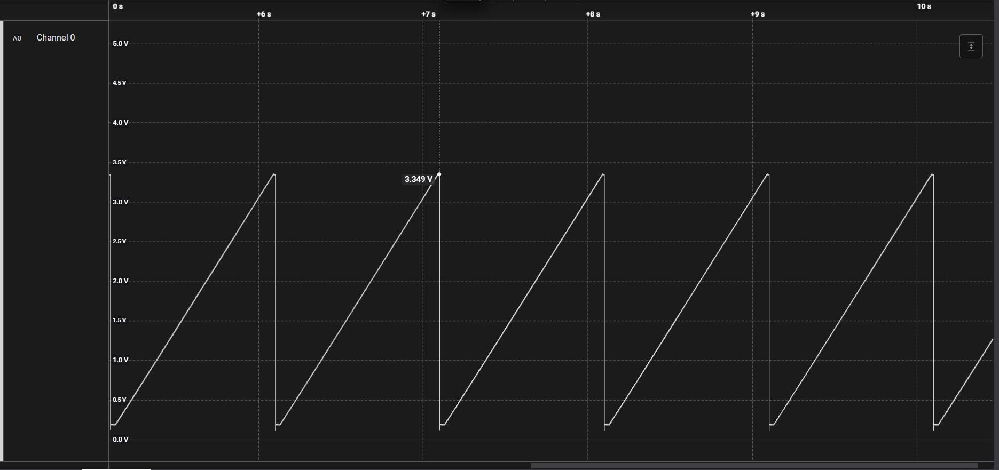
<br><br>
**Square wave:**
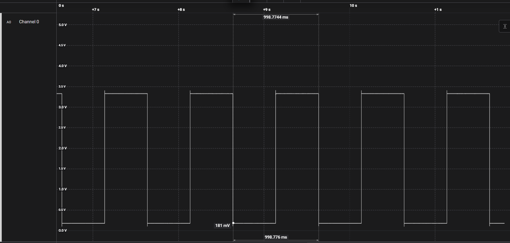
<br><br>

**Each of these waveforms is 1000 points/cycle. I generated these with a simple python script, which can be seen under a new folder I created called "wave_gen." I took the output I printed there and pasted it into the sinewavetable.h file.**

**After this, all that was left was to edit main.c so that button1 also included toggling between the new signals. I did that with this code:**

```c 
... 

// Triangle, falling/rising sawtooths, and square only used as a code, not points per cycle
enum points_per_cycle {ten=10,hundred=100,thousand=1000,triangle=1001,falling_sawtooth=1002,rising_sawtooth=1003, square=1004};

...

void Start_the_DAC_DMA(void)
	{
	 //First stop it, just to be clean (if running)
	HAL_DAC_Stop_DMA(&hdac1, DAC_CHANNEL_1);
	// Just use the global

	switch(points_to_use_in_a_cycle)
		{
		case ten:
		   HAL_DAC_Start_DMA(&hdac1, DAC_CHANNEL_1, (uint32_t*) sineLookupTable_10_pts, 10,DAC_ALIGN_12B_R);
			break;
		case hundred:
		   HAL_DAC_Start_DMA(&hdac1, DAC_CHANNEL_1, (uint32_t*) sineLookupTable_100_pts, 100,DAC_ALIGN_12B_R);
			break;
		case thousand:
		   HAL_DAC_Start_DMA(&hdac1, DAC_CHANNEL_1, (uint32_t*) sineLookupTable_1000_pts, 1000,DAC_ALIGN_12B_R);
			break;
		case triangle: // Code for triangle wave
		   HAL_DAC_Start_DMA(&hdac1, DAC_CHANNEL_1, (uint32_t*) triangleWave_1000_pts, 1000,DAC_ALIGN_12B_R);
			break;
		case falling_sawtooth: // Code for falling_sawtooth wave
		   HAL_DAC_Start_DMA(&hdac1, DAC_CHANNEL_1, (uint32_t*) falling_sawtoothWave_1000_pts, 1000,DAC_ALIGN_12B_R);
			break;
		case rising_sawtooth: // Code for rising_sawtooth wave
		   HAL_DAC_Start_DMA(&hdac1, DAC_CHANNEL_1, (uint32_t*) rising_sawtoothWave_1000_pts, 1000,DAC_ALIGN_12B_R);
			break;
		case square: // Code for square wave
		   HAL_DAC_Start_DMA(&hdac1, DAC_CHANNEL_1, (uint32_t*) square_wave_1000_pts, 1000,DAC_ALIGN_12B_R);
			break;
		}
	}

...

void change_points_per_cycle()
	{
	switch(points_to_use_in_a_cycle)
		{
		case ten:
			points_to_use_in_a_cycle = hundred;
			break;
		case hundred:
			points_to_use_in_a_cycle = thousand;
			break;
		case thousand:
			points_to_use_in_a_cycle = triangle;
			break;
		case triangle:
			points_to_use_in_a_cycle = falling_sawtooth; // Code for triangle wave
			break;
		case falling_sawtooth:
			points_to_use_in_a_cycle = rising_sawtooth; // Code for falling_sawtooth wave
			break;
		case rising_sawtooth:
			points_to_use_in_a_cycle = square; // Code for rising_sawtooth wave
			break;
		case square:
			points_to_use_in_a_cycle = ten; // Code for square wave
			break;
		}
		Start_the_DAC_DMA();
		MultiFunctionShield_Display(points_to_use_in_a_cycle);
	}

...

```

<br>

**This code also added 1001, 1002, 1003, and 1004 to the LED display cycle. This helped me to debug at first when the signals weren't working, to know which one I was supposed to be on.**

**I enjoyed this lab in general, particularly because of how it helped me understand DACs better. I hope to use this knowledge in my final group project in producing sound from an ESP.**